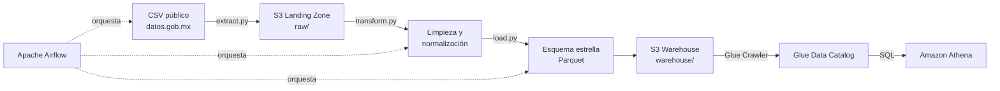

# Pipeline PROFECO: ETL orquestado con Airflow + AWS

Pipeline de datos end-to-end que extrae, transforma y carga datos públicos de quejas de consumidores ante PROFECO (Procuraduría Federal del Consumidor de México), orquestado con Apache Airflow y desplegado sobre infraestructura AWS.

## Motivación

Este proyecto es la extensión natural de mi experiencia automatizando procesos de datos en producción real durante mi trabajo en el Senado de la República (automatización que redujo un proceso de distribución de datos de 6 días a 20 minutos para 3,000+ usuarios). Aquí aplico la misma disciplina de resolver problemas reales de datos, ahora usando el stack estándar de la industria: orquestación con Airflow, almacenamiento cloud con S3, y consulta analítica con Athena.

**Nota de privacidad:** este proyecto usa exclusivamente datos públicos abiertos de PROFECO (`datos.gob.mx`), sin ninguna relación con sistemas o datos internos de mi empleo actual.

## Arquitectura



## Decisiones técnicas

**¿Por qué CSV en vez de la API en vivo de PROFECO?**
La fuente original planeada era la API pública de PROFECO (`datos.profeco.gob.mx/quejas/consulta.php`). Durante el desarrollo, el endpoint devolvía consistentemente error 500 (verificado con múltiples variantes de request). Se optó por el dataset CSV equivalente publicado en `datos.gob.mx` como fuente — mismo origen de datos oficial, sin dependencia de un endpoint inestable. Este es un patrón común en pipelines reales: la fuente no siempre es una API en vivo, a veces es un archivo publicado periódicamente.

**¿Por qué Parquet en vez de CSV para el output?**
Formato columnar, comprime significativamente mejor (110 MB → 11.77 MB en este proyecto) y es el estándar de facto para almacenamiento analítico en la industria.

**¿Por qué Athena en vez de Redshift Serverless?**
Athena no requiere mantener un cluster corriendo — se paga por consulta ejecutada, lo cual es más apropiado para un proyecto de portafolio sin necesidad de disponibilidad 24/7. Redshift Serverless queda como extensión natural si el objetivo es demostrar experiencia específica con esa herramienta.

**Diseño del esquema estrella**
- `fact_quejas`: una fila por queja, con llaves foráneas a las dimensiones
- `dim_proveedor`: empresa/proveedor (razón social, nombre comercial)
- `dim_ubicacion`: estado y área responsable
- `dim_categoria`: giro y sector comercial
- `dim_motivo`: motivo de la reclamación

## Stack técnico

| Capa | Herramienta |
|---|---|
| Orquestación | Apache Airflow 3.2.2 (Docker) |
| Procesamiento | Python 3.14, pandas |
| Almacenamiento | Amazon S3 |
| Catálogo de datos | AWS Glue |
| Consulta analítica | Amazon Athena (SQL) |
| Formato de datos | Parquet |

## Estructura del proyecto
## Cómo correrlo

**Prerequisitos:** Docker Desktop, cuenta de AWS con un bucket S3 configurado.

```bash
# Clona el repo
git clone https://github.com/Alexisboop13/profeco-etl-pipeline.git
cd profeco-etl-pipeline

# Configura tus credenciales de AWS en .env
echo "AWS_ACCESS_KEY_ID=tu_key" >> .env
echo "AWS_SECRET_ACCESS_KEY=tu_secret" >> .env
echo "AWS_DEFAULT_REGION=us-east-1" >> .env

# Levanta Airflow
docker compose up airflow-init
docker compose up -d

# Abre http://localhost:8080 (usuario/password: airflow/airflow)
# Activa y ejecuta el DAG "profeco_etl_pipeline"
```

## Insight de ejemplo

Una vez cargados los datos en Athena, es posible responder preguntas de negocio directamente con SQL:

```sql
SELECT c.giro, COUNT(*) AS total_quejas
FROM fact_quejas f
JOIN dim_categoria c ON f.categoria_id = c.categoria_id
WHERE f.estado_procesal = 'No Conciliada'
GROUP BY c.giro
ORDER BY total_quejas DESC
LIMIT 10;
```

**Resultado:** los suministradores de energía eléctrica encabezan las quejas no conciliadas con más del doble de casos que el segundo lugar (tiendas departamentales), seguidos por talleres mecánicos y compañías de autofinanciamiento — un hallazgo que sugiere fricción sistemática en la resolución de disputas con proveedores de servicios esenciales.

## Próximos pasos

- [ ] Agregar tests unitarios para las funciones de transformación
- [ ] Migrar `_PIP_ADDITIONAL_REQUIREMENTS` a una imagen custom de Airflow (mejor práctica para producción)
- [ ] Explorar Redshift Serverless como alternativa a Athena
- [ ] Agregar validación de calidad de datos (Great Expectations o similar)

## Autor

Alexis Dehesa — [LinkedIn](#) · [GitHub](https://github.com/Alexisboop13)
